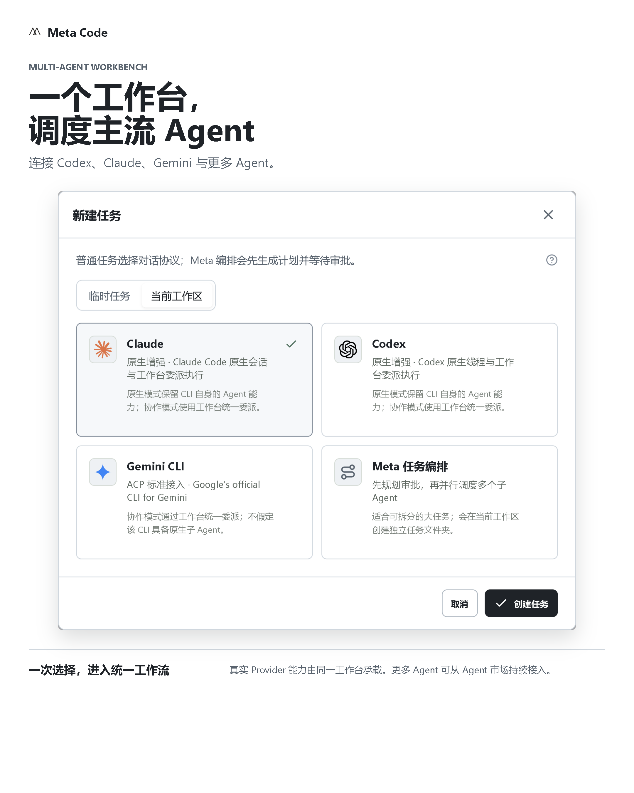
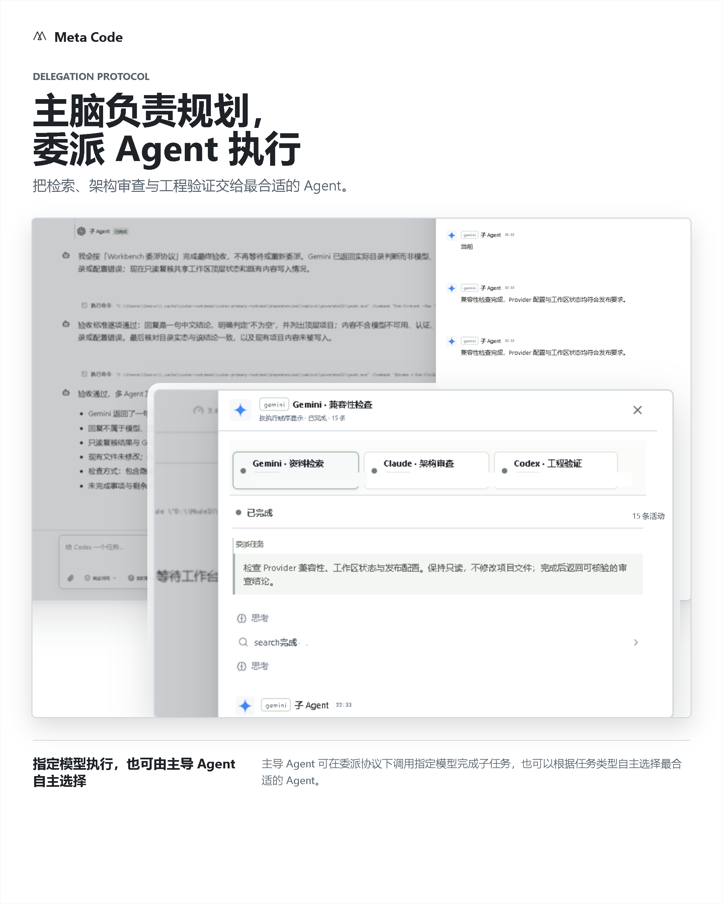
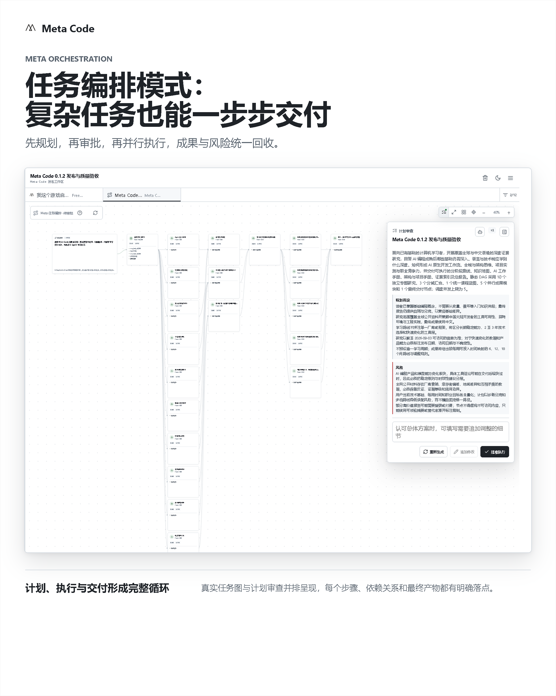
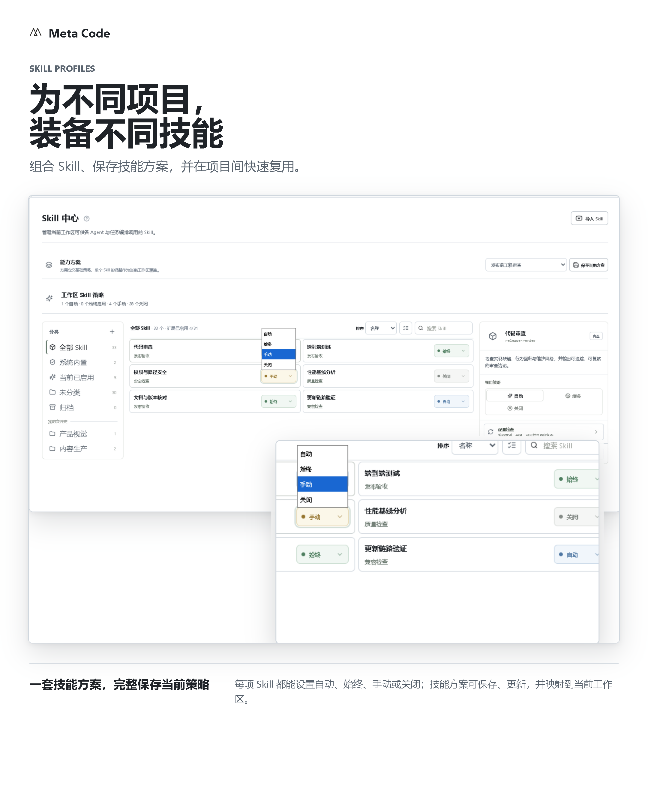
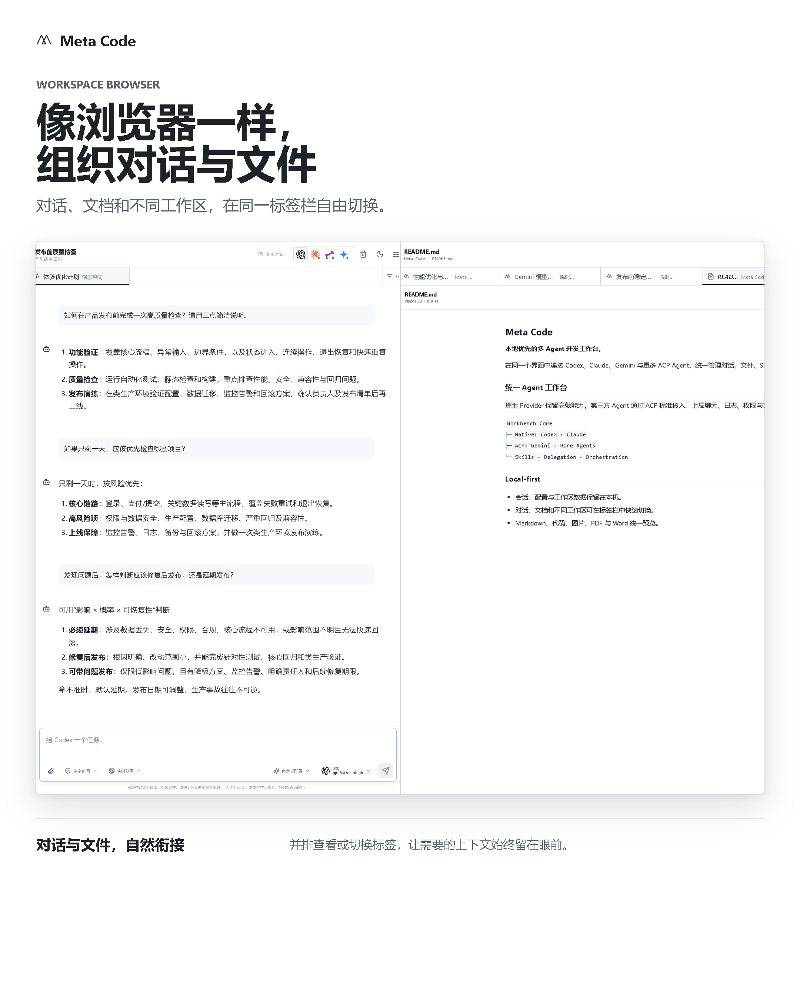
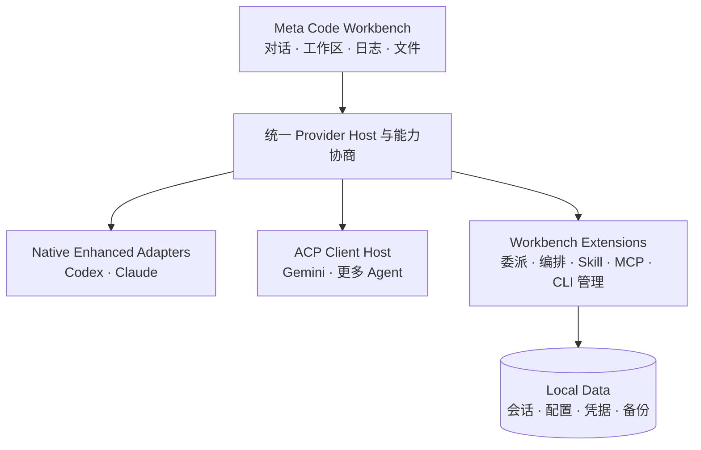

<div align="center">
  <picture>
    <source media="(prefers-color-scheme: dark)" srcset="./docs/images/meta-code-readme-dark.svg" />
    
  </picture>
  <h1>Meta Code</h1>
  <p><strong>让多个 Agent，在一个工作台协同完成任务。</strong></p>
  <p>连接 Codex、Claude、Gemini 与更多 Agent。统一对话、委派、编排、Skill、文件和交付。</p>
  <p>
    <a href="https://github.com/WuXinbo-bo/Meta-Code/releases/latest"><strong>下载最新版本</strong></a>
    · <a href="#快速开始">快速开始</a>
    · <a href="./docs/user-guide/">用户指南</a>
    · <a href="#开发与贡献">参与开发</a>
  </p>
  <p>
    
    
    
  </p>
</div>

<p align="center">
  
</p>

## 一个工作台，不止一个聊天窗口

Meta Code 是面向本地开发工作的多 Agent 工作台。你可以在一个界面中管理 Agent、模型连接、会话、工作区、Skill、MCP、文件预览和执行日志，并根据任务选择原生执行、委派协作或 Meta 任务编排。

- **原生增强**：保留 Codex 与 Claude 的线程、恢复、权限、子 Agent 和流式事件能力。
- **ACP 优先**：通过 [Agent Client Protocol](https://agentclientprotocol.com/) 接入 Gemini 及更多兼容 Agent。
- **本地优先**：会话、配置、Skill 和备份保存在本机，个人数据与程序及源码分离。
- **统一交付**：命令、工具调用、文件修改、Diff、失败和子 Agent 结果进入同一套活动记录。

## 两种特色工作方式

<table>
  <tr>
    <td width="50%" valign="top">
      
      <h3>委派协议</h3>
      <p><strong>主脑负责规划，合适的 Agent 负责执行。</strong></p>
      <p>主脑可把检索、编码、测试或审查工作委派给不同 Provider。你也可以指定执行者，实时查看子任务日志，最后由主脑统一验收和回复。</p>
      <p><a href="./docs/user-guide/delegation.md">了解委派协议 →</a></p>
    </td>
    <td width="50%" valign="top">
      
      <h3>Meta 任务编排</h3>
      <p><strong>复杂任务，按照依赖一步步交付。</strong></p>
      <p>规划 Agent 先生成任务图，由用户审批后执行。调度器管理依赖、并发、重试、验收条件与交付物，让长任务可以暂停、恢复和定点处理。</p>
      <p><a href="./docs/user-guide/task-orchestration.md">了解任务编排 →</a></p>
    </td>
  </tr>
</table>

委派协议适合一次对话中的动态协作；任务编排适合多阶段、强依赖、需要明确验收的项目。两者也可以组合：编排系统管理全局计划，具体节点再委派给最合适的 Agent。

## 围绕项目组织能力与上下文

<table>
  <tr>
    <td width="50%" valign="top">
      
      <h3>Skill 方案</h3>
      <p>组合、保存并复用不同项目需要的 Skill。方案可快速切换、更新和删除，并映射到当前工作区的执行环境。</p>
    </td>
    <td width="50%" valign="top">
      
      <h3>浏览器式工作区</h3>
      <p>在标签页中组织不同工作区的对话和文件。Markdown、公式、Mermaid、代码 Diff、图片、PDF 与 Word 均可在工作台内预览。</p>
    </td>
  </tr>
</table>

## Agent 接入架构

Meta Code 不要求所有 CLI 放弃原生能力，也不为每个 Agent 重造一套私有协议。上层使用统一的 Provider 能力模型，底层允许两类传输并存：



| 能力 | Codex | Claude | ACP Agent |
| --- | --- | --- | --- |
| 接入方式 | 原生增强 | 原生增强 | ACP 标准协议 |
| 会话与恢复 | 支持 | 支持 | 根据能力协商 |
| 工具、命令与 Diff | 支持 | 支持 | 根据能力协商 |
| 委派与任务编排 | 支持 | 支持 | 满足运行能力后支持 |
| 模型、模式与推理配置 | Provider 动态配置 | Provider 动态配置 | ACP Config Options |

这种结构让 Codex 和 Claude 保留高级体验，同时使后续 Agent 可以通过标准协议进入同一个工作台。更多细节见[架构总览](./docs/architecture/overview.md)与 [CLI 运行时架构](./docs/architecture/cli-runtime.md)。

## 快速开始

### 安装版

前往 [GitHub Releases](https://github.com/WuXinbo-bo/Meta-Code/releases/latest) 下载 Windows 安装程序。首次启动后，在 **设置 → Agent** 中检测或配置至少一个 CLI 与模型连接，然后创建工作区和任务。

> 当前安装包尚未进行 Authenticode 签名，Windows 可能显示“未知发布者”。请只从本仓库的 Releases 页面下载。

### 从源码运行

需要 Windows 10/11、Node.js 22 或更高版本以及 npm。

```powershell
git clone https://github.com/WuXinbo-bo/Meta-Code.git
Set-Location Meta-Code
npm install
npm run dev
```

浏览器打开 `http://127.0.0.1:4339/`。本地 API 默认监听 `127.0.0.1:4338`。

生产构建：

```powershell
npm run typecheck
npm run build
npm start
```

## 数据、安全与更新

- 个人数据默认位于 `%USERPROFILE%\.metacode`，可通过 `METACODE_HOME` 修改位置。
- 工作区源码始终保留在用户选择的原目录，Meta Code 只保存工作区引用。
- API Key、MCP 环境变量和秘密请求头进入本机凭据库，不写入普通状态数据。
- CLI 支持系统版本、指定路径和工作台托管版本；托管更新不会覆盖外部 CLI。
- 设置页支持版本检查、发布频道、跳过版本和兼容性判断，更新信息来自 GitHub Releases 的受校验清单。
- 升级或卸载程序不会主动删除个人数据；重要操作前仍建议在设置中创建备份。

详见[数据与运行目录](./docs/architecture/data-and-runtime.md)、[安全策略](./SECURITY.md)和[发布与更新架构](./docs/development/release-and-update.md)。

## 当前状态

Meta Code 当前版本为 `0.1.2`，主要面向 Windows 本地单用户环境。

- Codex 与 Claude 使用原生增强路径。
- 第三方 Provider 的具体能力取决于其 ACP 实现和运行时能力协商。
- 应用内更新当前提供检查与发布公告，下载后由用户启动安装程序。
- 项目仍处于早期版本，接口和交互会继续迭代。

## 开发与贡献

提交改动前至少运行：

```powershell
npm run typecheck
npm run build
```

根据修改范围补充运行 `package.json` 中对应的领域测试。开发环境、仓库边界和贡献流程分别见：

- [开发环境](./docs/development/setup.md)
- [贡献指南](./CONTRIBUTING.md)
- [架构文档](./docs/architecture/)
- [用户指南](./docs/user-guide/)
- [变更记录](./CHANGELOG.md)

## License

Meta Code 使用 [Apache License 2.0](./LICENSE)。第三方集成保留各自许可证。
