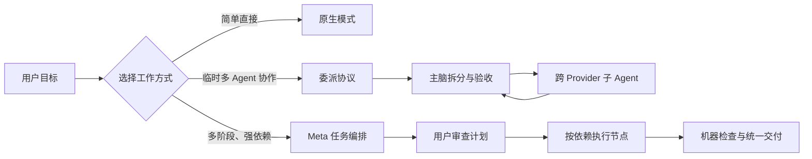
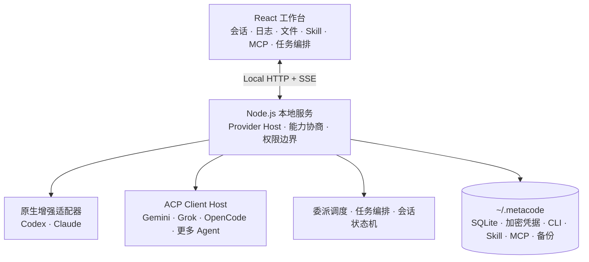

<div align="center">
  <picture>
    <source media="(prefers-color-scheme: dark)" srcset="./docs/images/meta-code-readme-dark.svg" />
    
  </picture>
  <h1>Meta Code</h1>
  <p><strong>本地优先的多 Agent 开发工作台</strong></p>
  <p>在一个界面中连接、协作、编排并验收 Codex、Claude 与 ACP Agent。</p>
  <p>
    
    
    
    
    
  </p>
  <p>
    
    
    
  </p>
  <p>
    <a href="#两种特色工作方式">特色模式</a> ·
    <a href="#核心能力">核心能力</a> ·
    <a href="#架构">架构</a> ·
    <a href="https://github.com/WuXinbo-bo/Meta-Code/releases/latest">下载</a> ·
    <a href="#开发运行">开始运行</a> ·
    <a href="docs/user-guide/">用户指南</a>
  </p>
</div>

---

Meta Code 统一管理编码 CLI、模型连接、会话、工作区、Skill、MCP、文件预览和执行日志。它保留 Codex 与 Claude 的原生增强能力，并通过 [Agent Client Protocol (ACP)](https://agentclientprotocol.com/) 接入更多 Agent。当前版本为 `0.1.2`，优先支持 Windows 与本地单用户场景。

## 两种特色工作方式

Meta Code 不只是把多个 CLI 放进同一个窗口。它在统一 Agent 适配层之上提供两种互补的多 Agent 工作方式：

<table>
  <tr>
    <td width="50%" valign="top">
      <h3>委派协议</h3>
      <p><strong>对话内的动态多 Agent 协作</strong></p>
      <p>主脑把边界清晰的编码、测试、调研或审查任务交给其他已连接 Agent，统一收集实时日志、命令、文件 Diff、失败状态和验收结果，最后仍由主脑复核并交付。</p>
      <p><a href="docs/user-guide/delegation.md">查看委派协议指南 →</a></p>
    </td>
    <td width="50%" valign="top">
      <h3>Meta 任务编排</h3>
      <p><strong>审批式、可恢复的复杂任务执行系统</strong></p>
      <p>规划 Agent 先生成静态任务图。用户批准后，调度器才按依赖和并发上限运行节点，并记录 Provider、权限、Skill、MCP、验收条件、交付物和重试过程。</p>
      <p><a href="docs/user-guide/task-orchestration.md">查看任务编排指南 →</a></p>
    </td>
  </tr>
</table>



| | 委派协议 | Meta 任务编排 |
| --- | --- | --- |
| 入口 | 普通对话的“协作”运行模式 | 新任务中的独立编排模式 |
| 适合 | 一次对话里可独立验证的编码、测试、调研或审查 | 有明确依赖、交付物和验收要求的长任务 |
| 控制者 | 主脑 Agent 动态拆分并回收结果 | 用户先审查计划，调度器再执行冻结的任务图 |
| 执行记录 | 子 Agent 会话、实时日志、命令、Diff 和结果 | 节点状态、依赖、尝试记录、机器检查和成果目录 |
| 失败处理 | 主脑继续委派、重试或改派 | 暂停、定点重试失败节点，再继续集成 |
| 最终交付 | 主脑复核后统一回复 | 集成阶段按交付标准统一验收 |

两者可以组合：任务编排负责长期计划、依赖和验收；编排节点仍可通过委派协议调用合适的 Agent。简单任务使用原生模式，临时协作使用委派协议，复杂项目使用 Meta 任务编排。

## 核心能力

| 能力 | 体验 |
| --- | --- |
| **原生增强 + ACP 优先** | Codex 和 Claude 保留线程、恢复、子 Agent 与流式日志；第三方 CLI 优先通过 ACP 接入 |
| **Agent 市场与运行时** | 检测系统 CLI、指定已有路径或安装工作台托管版本；版本隔离、校验和回滚不污染系统 CLI |
| **统一模型连接** | 支持账号、官方 API 和兼容端点，并按 Provider 能力提供连接测试、模型探测、模式和思考强度 |
| **完整本地工作区** | 在同一工作台查看会话、文件树、Markdown、公式、Mermaid、PDF、Word 和代码 Diff |
| **Skill 与 MCP** | 按工作区保存能力方案、Skill 调用策略和 MCP 工具连接 |
| **本地数据与恢复** | 个人状态位于 `~/.metacode`，与源码和程序版本分离，更新或卸载不会自动删除个人数据 |

## 架构



更完整的边界见[架构总览](docs/architecture/overview.md)、[数据与运行目录](docs/architecture/data-and-runtime.md)和[CLI 运行时架构](docs/architecture/cli-runtime.md)。

## 开发运行

要求：Windows 10/11、Node.js 22 或更高版本、npm，以及至少一个受支持的 Agent CLI。

```powershell
git clone https://github.com/WuXinbo-bo/Meta-Code.git
Set-Location Meta-Code
npm install
npm run dev
```

打开 `http://127.0.0.1:4339/`。开发服务只监听本机；API 默认位于 `127.0.0.1:4338`。

生产构建：

```powershell
npm run typecheck
npm run build
npm start
```

常用验证命令和贡献要求见[开发指南](docs/development/setup.md)与 [CONTRIBUTING.md](CONTRIBUTING.md)。

## 数据与安全

- 个人数据默认保存在 `%USERPROFILE%\.metacode`；可通过 `METACODE_HOME` 覆盖。
- API Key、MCP 环境变量和请求头秘密值进入本机凭据库，不写入普通状态数据库。
- 工作区源码保留在用户选择的原目录，Meta Code 只保存引用。
- 备份或恢复前应停止所有 Meta Code 进程。恢复命令为 `npm run data:restore -- --stamp <时间戳>`。
- 不要提交 `.claude-codex/`、`.runtime/`、数据库、日志、密钥或个人会话。

## 更新状态

设置页已经支持版本检查、更新频道、跳过版本和兼容性判断。稳定版从 GitHub Release 的固定 `latest.json` 地址检查更新；`0.1.2` 不会自动覆盖正在运行的程序，更新时会打开对应 Release 页面。未来独立 Launcher 负责下载、校验、原子切换和失败回滚。详见[发布与更新架构](docs/development/release-and-update.md)。

## 当前限制

- 当前主要在 Windows 上开发和验证。
- Codex 与 Claude 保留原生增强路径；其他 Provider 的能力取决于其 ACP 实现与能力协商结果。
- 更新模块当前只开放检查与公告；正式下载和应用更新将在 Launcher 与签名链完成后启用。
- `0.1.2` 桌面安装包尚未进行 Authenticode 签名，Windows 可能显示未知发布者提示。

## 文档

- [用户指南](docs/user-guide/)
- [架构文档](docs/architecture/)
- [开发与发布](docs/development/)
- [安全策略](SECURITY.md)
- [变更记录](CHANGELOG.md)

## License

Meta Code 使用 [Apache License 2.0](LICENSE)。第三方集成保留各自许可证；例如 `integrations/blender-mcp` 使用其目录内的 MIT License。
