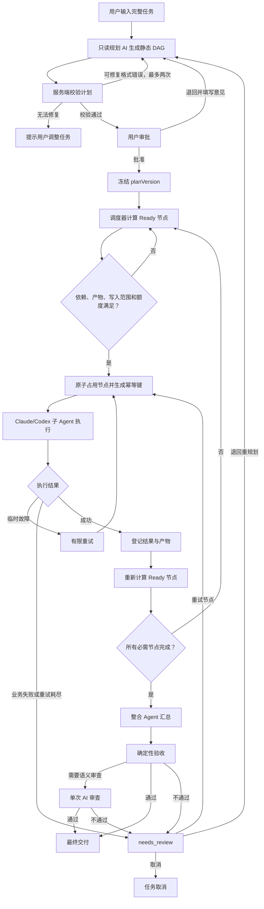

# 审批式任务编排模式技术基线

> 状态：已批准（Approved Baseline）  
> 版本：1.0  
> 日期：2026-08-10  
> 适用项目：Meta Code

## 1. 文档目的

本文档是新增“任务编排模式”的正式技术基线，用于约束后续 AI 和开发者的设计、实现与验收。

后续实现不得在没有明确重新评审的情况下偏离以下核心边界：

- 第一版采用审批冻结的静态 DAG，不采用任意动态 DAG。
- 新模式与现有自由对话模式并存，不能破坏或替换现有行为。
- AI 负责规划、节点执行和结果整合；系统负责审批、依赖、并发、状态、幂等、重试、恢复和最终门禁。
- 未经用户审批的计划不得启动执行节点。
- 子 Agent 的自然语言回复不能单独作为任务完成依据，必须登记结构化结果。

本文档中的 MUST 表示必须遵守，SHOULD 表示默认应遵守，DEFERRED 表示第一版禁止实现或必须延期。

## 2. 模式定位

工作台保留两套相互隔离但底层同源的使用模式。

### 2.1 自由对话模式

现有 Claude/Codex 主脑继续通过当前委派 Skill 自主分析、委派、等待和验收。

该模式适合：

- 探索性工作
- 连续对话
- 需求频繁变化
- 不适合预先完整拆分的任务

### 2.2 任务编排模式

用户一次性输入完整任务，由规划 AI 生成结构化任务图，用户批准后由系统确定性调度多个子 Agent，最后统一整合和验收。

该模式适合：

- 可以拆成多个领域或模块的大任务
- 同时包含独立任务和前置依赖的任务
- 需要多人式分工、明确产物和统一交付的任务
- 需要审批、恢复和执行过程可观测性的任务

## 3. 一句话定义

任务编排模式是一个“AI 项目经理系统”：AI 提交施工计划，用户批准计划，系统组织多个 AI 按依赖并行或串行施工，最后统一验收交付。

## 4. 第一版范围

第一版 MUST 实现：

1. 用户输入完整任务、选择工作区和规划模型。
2. 规划 AI 在只读环境中生成结构化静态 DAG。
3. 服务端校验节点、依赖、环路、Skill、产物声明、写入范围和节点数量。
4. 用户批准整个计划，或填写意见退回重新规划。
5. 批准后冻结 `planVersion`。
6. 无依赖节点并行执行，有依赖节点等待前置节点成功。
7. 支持结构化文本结果和文件产物结果。
8. 支持临时故障有限重试。
9. 业务失败进入人工处理状态，不进行无限自动重规划。
10. 必需节点完成后执行统一整合。
11. 执行确定性验收；语义任务按需进行一次 AI 审查。
12. 工作台重启后能够恢复工作流状态和未完成节点。
13. UI 显示计划、节点状态、依赖关系、子 Agent 日志、失败信息和最终成果。

## 5. 第一版明确不做

以下能力标记为 DEFERRED：

- 任意条件表达式或可执行条件 DSL
- 运行过程中由模型静默修改已批准任务图
- 无人监督的循环重规划
- 完整动态 DAG
- 拖拽式任务图编辑器
- Git worktree 自动创建、合并和冲突修复
- 多层风险 Agent、整合 Agent、验收 Agent反复循环
- 模型失败后未经用户确认自动切换提供方
- 精确 Token、成本和完成时间预测
- AI 自动判断复杂语义文件冲突
- 只批准某一波并让后续计划自动变化的多级审批

这些能力只有在第一版闭环经过实际验证后，才能通过新的基线版本引入。

## 6. 核心系统不变量

实现 MUST 保证：

1. 未审批计划绝不执行。
2. 已批准的计划版本不能被静默修改。
3. 依赖未满足的节点不能进入执行状态。
4. 写入范围冲突的节点不能并行执行。
5. 同一节点的同一次尝试只能产生一次有效受理。
6. 达到并发上限只代表等待，不能被记录为执行失败。
7. 下游节点只能消费已登记的上游结果和产物。
8. 必需节点失败时不能进入最终整合。
9. 产物型节点没有登记产物时不能被判定为成功。
10. 分析型节点允许只提交结构化文本结果，不强制生成文件。
11. 整体完成必须以最终验收通过为准。
12. 服务重启不能造成节点重复副作用。
13. 所有工作流状态、事件和访问必须按用户及工作区隔离。
14. 每个工作流必须建立独立运行目录，用于计划快照、节点结果、日志索引和最终产物；现有项目源码仍按节点 `writeScope` 原位修改，不通过复制工作区伪造隔离。

## 7. 正式流程



## 8. 规划阶段

规划阶段 MUST 是只读过程：

- 禁用原生子 Agent。
- 禁用工作台委派桥接。
- Codex 使用只读 sandbox。
- Claude 禁用写入和修改类工具。
- 规划结果必须符合固定 JSON Schema。
- 格式修复最多自动尝试两次。
- 审批等待期间不保留 AI 进程。

规划 AI 可以推荐 Claude、Codex 和 Skill，但系统必须验证被引用的执行器和 Skill 确实可用。

## 9. 计划与节点合同

计划由多个通用节点组成。`parallel` 和 `dependent` 不是独立节点类型，而是由 `dependsOn` 推导出的调度结果。

```json
{
  "id": "frontend",
  "title": "实现审批界面",
  "objective": "完成计划展示、批准和退回交互",
  "dependsOn": ["workflow-contract"],
  "provider": "codex",
  "skills": ["frontend-design"],
  "workspaceAccess": "write",
  "writeScope": ["src/workflow/**"],
  "requiredArtifacts": ["workflow-contract.json"],
  "deliverables": ["src/workflow/ApprovalView.tsx"],
  "acceptance": ["生产构建通过", "审批状态可以恢复"],
  "failurePolicy": "retry_then_review",
  "required": true
}
```

节点 MUST 包含：

- 稳定且唯一的节点 ID
- 清晰目标
- 依赖节点列表
- 执行器或 `auto`
- Skill 列表
- 工作区访问模式
- 写入范围
- 预期产物
- 可验证验收标准
- 失败策略
- 是否为必需节点

## 10. 依赖与任务形态

静态 DAG 必须支持：

- 扇出：一个上游任务解锁多个并行任务。
- 串行：后续任务依赖前置产物。
- 汇合：多个上游任务共同解锁一个整合任务。
- 风险分析：作为普通只读分析节点，与其他分析任务并行。
- 产物依赖：下游任务启动前确认指定产物已经登记。

第一版不支持模型生成的任意条件表达式。突发变化通过 `needs_review` 处理；需要改变任务图时生成新的计划版本并重新审批。

## 11. 调度器

调度器 MUST 是确定性的，不能让 AI 决定节点何时启动。

每轮调度执行：

1. 查询所有未完成节点。
2. 将依赖全部成功的节点标记为 `ready`。
3. 检查所需产物是否存在。
4. 检查 `writeScope` 与运行节点是否重叠。
5. 检查单工作流和全局并发额度。
6. 在事务中将节点从 `ready` 更新为 `queued`。
7. 生成稳定幂等键并调用公共 Agent 执行层。
8. 节点终态后重新计算可运行节点。

并发限制沿用现有规则：

- 单个工作流最多同时运行 5 个子 Agent。
- 工作台全局最多同时运行 20 个子 Agent。

系统无需保存独立 Wave 实体。Ready 队列和依赖关系会自然形成执行波次。

## 12. Claude 与 Codex 分工

规划器可以根据能力倾向推荐执行器：

- Claude：复杂语义理解、歧义分析、创意、长文、架构审查和综合判断。
- Codex：代码、文件修改、命令执行、测试、仓库排查和结构化实现。

这些只是推荐，不是写死的上下级关系。用户可以在审批阶段覆盖节点执行器。

未经用户批准，系统 SHOULD NOT 在失败后自动切换模型提供方。

## 13. Skill 规则

- 复用现有工作区 Skill 策略和 Skill 原生投影能力。
- 规划器只可以从当前工作区允许的 Skill 中推荐。
- 每个节点只注入完成该节点所必需的 Skill 和上下文。
- Skill 不得获得整个主任务的隐藏对话上下文。
- Skill 缺失必须在审批前被服务端识别。

## 14. 上下文传递

子 Agent 不共享规划 AI 或其他 Agent 的完整对话。

服务端必须为每个节点构建最小上下文包：

- 用户原始目标
- 当前批准的计划版本
- 当前节点目标与验收标准
- 必要约束
- 相关文件路径
- 已登记的上游摘要和产物
- 允许的 Skill
- 写入范围

不得把所有历史消息无差别复制给每个节点。

## 15. 文件冲突策略

第一版采用保守调度：

- 只读任务可以并行。
- 写入范围明确且不重叠的任务可以并行。
- `writeScope` 重叠的任务必须串行。
- 无法判断写入范围时，同一工作区最多运行一个写入型节点。
- `writeScope` 是调度约束和提示，不是绝对安全沙箱。
- 节点完成后应登记实际修改文件，供整合与验收检查。

Git worktree 隔离属于后续版本能力。

## 16. 节点结果合同

节点终态结果必须结构化：

```json
{
  "summary": "完成审批界面",
  "artifacts": ["src/workflow/ApprovalView.tsx"],
  "changedFiles": ["src/workflow/ApprovalView.tsx"],
  "tests": [
    { "command": "npm run build", "status": "passed" }
  ],
  "risks": ["尚未覆盖浏览器断线恢复"]
}
```

结果规则：

- 文本分析节点必须提交 `summary`。
- 产物节点必须登记 `artifacts`。
- 修改工作区的节点必须登记 `changedFiles`。
- 执行过测试时必须登记命令和状态。
- 未解决问题必须登记到 `risks`。
- 工作台应校验文件是否真实存在，并对实际文件记录 hash。

## 17. 失败与突发情况

失败分为两类：

### 17.1 临时故障

例如进程启动失败、网络中断、可重试超时和临时 API 错误。

- 自动重试最多两次。
- 重试使用同一节点的新 attempt。
- 每次 attempt 具有独立幂等键。
- 重试之间采用有限退避。

### 17.2 业务失败

例如验收不通过、产物缺失、任务理解错误或无法完成。

- 不进行无限自动重试。
- 工作流进入 `needs_review`。
- 用户可以选择重试节点、退回重新规划或取消任务。
- 重新规划必须生成新的 `planVersion` 并重新审批。

## 18. 整合与验收

整合不是拼接 Agent 回复。

整合 Agent 必须读取：

- 用户原始任务
- 批准的计划版本
- 所有必需节点的结构化摘要
- 真实产物清单和 hash
- 实际修改文件
- 测试结果
- 风险与未完成项

验收顺序：

1. 文件是否存在。
2. 依赖产物是否完整。
3. 命令和测试是否通过。
4. 原始用户目标是否满足。
5. 跨节点结果是否一致。
6. 语义任务按需执行一次 AI 审查。

第一版不默认运行多层 AI 审查循环。

## 19. 状态机

Workflow 状态：

```text
draft
→ planning
→ awaiting_approval
→ queued
→ running
→ integrating
→ completed
```

异常状态：

```text
needs_review
paused
failed
canceled
```

Node 状态：

```text
pending
→ ready
→ queued
→ running
→ completed
```

辅助状态：

```text
retry_wait
failed
blocked
skipped
canceled
interrupted
```

## 20. 持久化设计

新模式必须使用现有 SQLite 数据库连接，但使用独立表和独立 Repository。不得把工作流完整状态塞入 Session JSON，也不应另开一个独立工作流数据库。

第一版表：

### workflow_runs

- id
- owner_user_id
- workspace_id
- original_prompt
- planner_engine
- status
- active_plan_version
- revision
- deadline_at
- created_at
- updated_at

### workflow_plan_versions

- workflow_id
- version
- status
- plan_json
- review_note
- approved_at
- created_at

### workflow_nodes

- id
- workflow_id
- plan_version
- node_key
- status
- provider
- prompt
- depends_json
- skill_names_json
- write_scope_json
- acceptance_json
- failure_policy
- attempt
- idempotency_key
- delegated_task_id
- summary_json
- error
- lease_expires_at
- started_at
- finished_at

### workflow_artifacts

- id
- workflow_id
- node_id
- path
- kind
- hash
- summary
- created_at

第一版不要求单独建立 `workflow_edges` 表，边可以保存在节点的 `depends_json` 中。

## 21. 执行层边界

现有自由对话委派强依赖 Session、主脑等待屏障和委派 Skill。新模式不能伪造隐藏 Session 来复用整套会话状态机。

正确做法是抽取公共底层：

```text
AgentExecutor
├── 现有自由对话委派包装
└── 新 WorkflowOrchestrator
```

`AgentExecutor` 只负责：

- 启动 Claude/Codex
- 传递节点上下文
- 采集日志
- 超时和取消
- 进程树清理
- 返回结构化终态

自由对话与任务编排必须保持各自独立的上层状态机。

## 22. API 边界

建议使用独立前缀：

```text
POST /api/workflows
GET  /api/workflows/:id
POST /api/workflows/:id/plan
POST /api/workflows/:id/approve
POST /api/workflows/:id/revise
POST /api/workflows/:id/pause
POST /api/workflows/:id/resume
POST /api/workflows/:id/cancel
POST /api/workflows/:id/nodes/:nodeId/retry
GET  /api/workflows/:id/artifacts
```

所有写接口必须检查 workflow revision，避免重复审批、重复启动和旧页面覆盖新状态。

## 23. 事件流

复用现有 SSE/EventHub，新增事件：

```text
workflow.created
workflow.plan.ready
workflow.plan.approved
workflow.plan.rejected
workflow.node.ready
workflow.node.started
workflow.node.completed
workflow.node.failed
workflow.needs_review
workflow.integration.started
workflow.completed
workflow.canceled
```

事件必须携带 `workflowId`、`workspaceId`、`revision` 和必要的 `nodeId`。

SSE 只负责通知；断线恢复必须以 `GET /api/workflows/:id` 返回的数据库快照为准。

## 24. UI 基线

创建任务时增加两个清晰入口：

- 自由对话
- 任务编排

任务编排页面分三个阶段：

### 输入阶段

- 完整任务文本框
- 工作区选择
- 规划模型选择
- 附件和允许使用的 Skill

### 审批阶段

- 只读依赖关系图
- 紧凑节点列表
- 模型和 Skill
- 依赖、写入范围、产物和验收标准
- 批准按钮
- 退回意见输入框

### 执行阶段

- 整体状态
- 当前可运行、运行中、等待和失败节点
- 子 Agent 日志抽屉
- 节点结果和产物
- 重试、重新规划、暂停和取消操作
- 最终整合结果

第一版关系图只读；节点修改通过列表或侧边面板完成，不开发拖拽编辑器。

## 25. 重启恢复

工作台启动时必须扫描未结束工作流：

- `awaiting_approval` 保持等待，不启动任何进程。
- `queued` 和 `ready` 节点重新进入调度。
- 失去进程的 `running` 节点标记为 `interrupted`。
- 清理关联孤儿进程。
- 根据幂等键和失败策略决定重新排队或进入 `needs_review`。
- 已登记完成的节点不得重复执行。
- `integrating` 状态可以重新执行幂等的整合步骤。

重启恢复不尝试继续附着旧 CLI 进程。

## 26. 验收标准

第一版只有满足以下条件才能视为完成：

1. 自由对话模式行为没有回归。
2. 未审批计划无法触发任何子 Agent。
3. 可以正确执行并行、串行、扇出和汇合任务。
4. 循环依赖计划会被拒绝。
5. 写入范围冲突节点不会并行。
6. 达到并发上限的节点保持等待。
7. 临时故障按策略有限重试。
8. 业务失败进入 `needs_review`。
9. 用户可以退回计划并生成新版本。
10. 服务重启后不会重复执行已完成节点。
11. 工作区和用户之间的工作流事件不会串流。
12. 节点日志可以在现有子 Agent UI 中查看或通过同源组件查看。
13. 产物、修改文件和测试结果能够被最终整合阶段读取。
14. 必需节点失败时不能产生成功交付。
15. 最终结果只有在验收通过后进入 `completed`。

## 27. 推荐实施阶段

### 阶段一：基础闭环

- 数据表与 Repository
- 规划 JSON Schema
- 计划校验
- 审批和退回
- 静态 DAG 调度
- AgentExecutor 公共执行边界
- 节点日志和状态
- 基础整合与验收

### 阶段二：正式服务能力

- 重启恢复
- lease 与心跳
- 文件范围冲突控制
- 结构化产物登记
- SSE 隔离
- 幂等与临时故障重试
- 全链路自动化测试

### 阶段三：基线重新评审后的增强

- 有限条件分支
- 增量计划版本差异
- Git worktree 隔离
- 可视化编辑
- 成本预算
- 高级质量审查

阶段三内容不得在没有更新本文档版本的情况下混入第一版。

## 28. 后续 AI 执行约束

后续 AI 在实现本模式前 MUST：

1. 完整阅读本文档。
2. 先检查当前 Git 状态和最新提交。
3. 保持自由对话模式兼容。
4. 按阶段实施，不一次性引入 DEFERRED 能力。
5. 数据模型、状态机或核心不变量发生变化时，先提出理由并等待用户确认。
6. 每个阶段修改前建立 Git 检查点。
7. 每个阶段完成后运行构建、状态存储、SSE、重启恢复和委派链路测试。
8. 不以提示词代替服务端状态校验和权限边界。

## 29. 基线变更流程

本文档是版本 1.0 的批准基线。

以下变化必须先更新基线并由用户重新确认：

- 从静态 DAG 改为动态 DAG
- 修改审批门禁
- 允许计划在执行中自动变化
- 修改并发规则
- 修改工作区写入隔离策略
- 修改结果完成判定
- 修改重启恢复语义
- 合并自由对话和工作流状态机
- 引入自动模型切换或自动 Git 合并

修订时必须记录新版本、变更原因、兼容性影响和迁移策略。
